# Project 5: GitOps-Based Kubernetes Application Deployment using ArgoCD

## Project Overview:

This project demonstrates a **GitOps workflow** for Kubernetes applications using **ArgoCD**. All deployments follow GitOps principles:

> "No manual kubectl changes in production. All deployments happen via Git repository updates."
---
## Architecture Diagram:
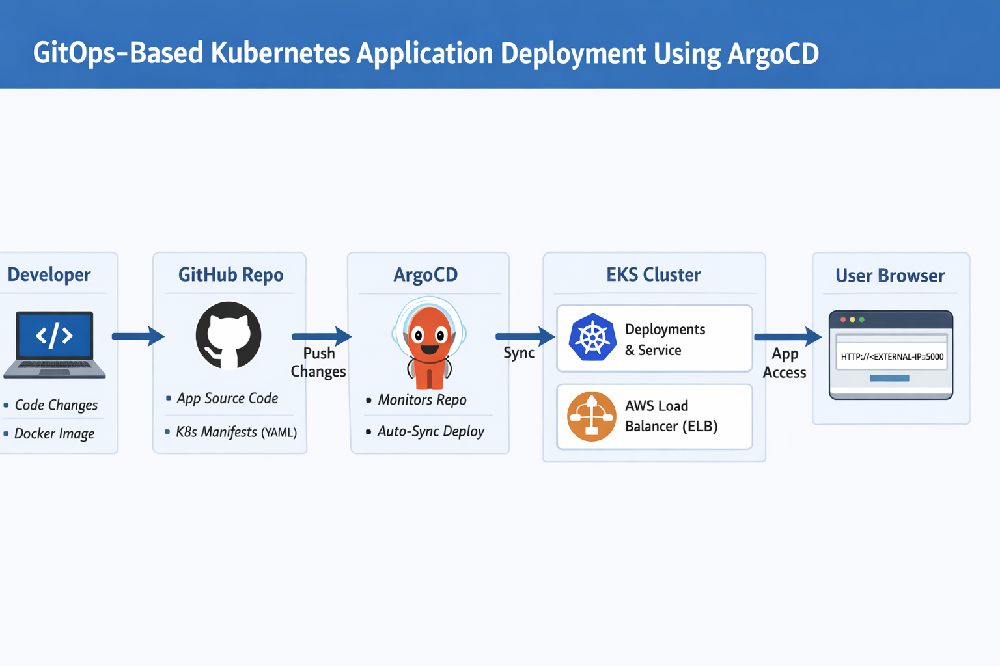

---
## Technologies & Tools:

* Docker
* Kubernetes (EKS)
* ArgoCD
* GitHub
---

## Project Objectives:

1. Containerize the application.
2. Store Kubernetes manifests in Git.
3. Configure ArgoCD to monitor the Git repository.
4. Enable automatic sync on Git commits.
---

## Project Steps:

### 1. Instance Running:
- AMI - **Ubuntu**
- Instance-type - **t2.medium**
- Key-pair - **Project-5**
- Security-Group:
  ```
  Ports:
  22
  80
  443
  8080
  30000-32767
  ```
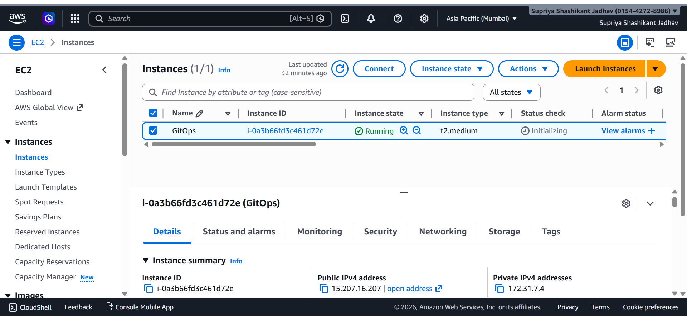

### 2. Install Dependencies:
- Install Docker 
- Install Kubectl
- Install Eksctl
- Install AWS_CLI

### 3. Containerization:

* Dockerfile created.
* Build image:

```bash
docker build -t iamsupriya2112/my-app .
```

* Push to registry:

```bash
docker push iamsupriya2112/my-app
```
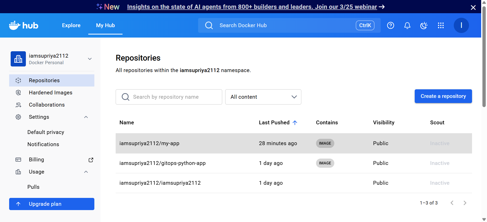

### 4. Kubernetes Setup:

* EKS cluster created.

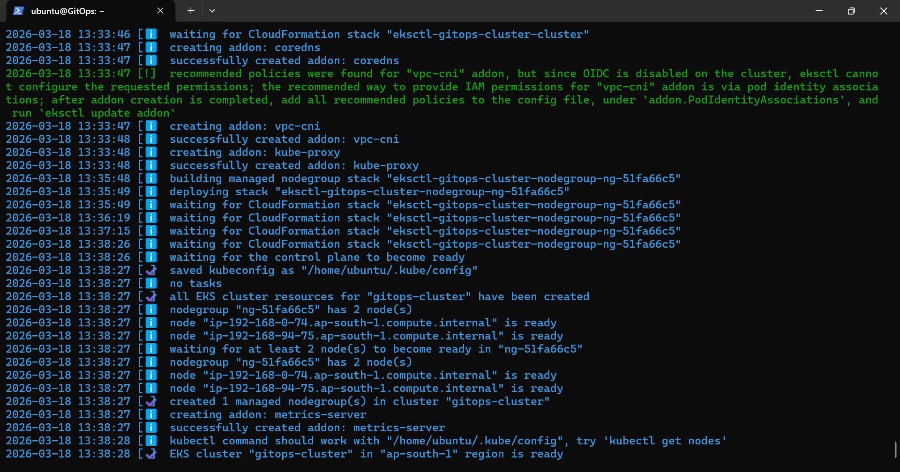

AWS-Console:
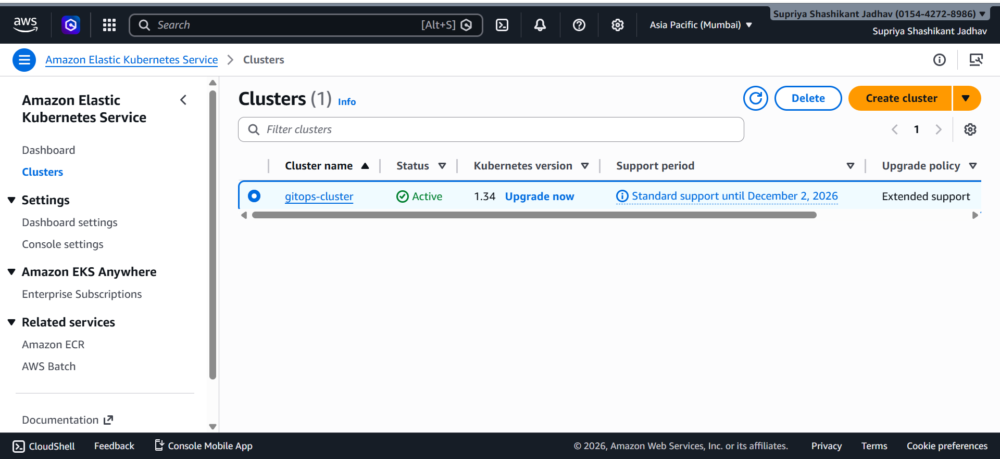
* Deployment YAML (`deployment.yaml`) and Service YAML (`service.yaml`) created.
* Apply manifests:

```bash
kubectl apply -f deployment.yaml -n my-app
kubectl apply -f service.yaml -n my-app
```

* Verify pods and services:

```bash
kubectl get pods -n my-app
kubectl get svc -n my-app
```
Cluster-Nodes:
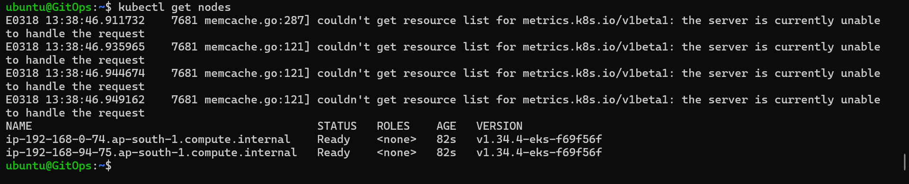

Pods-Running:
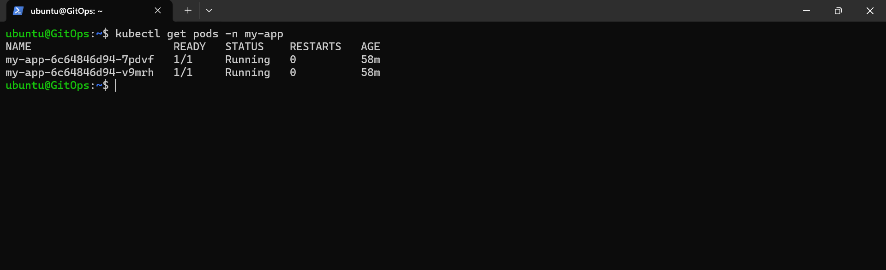

Service-Status:
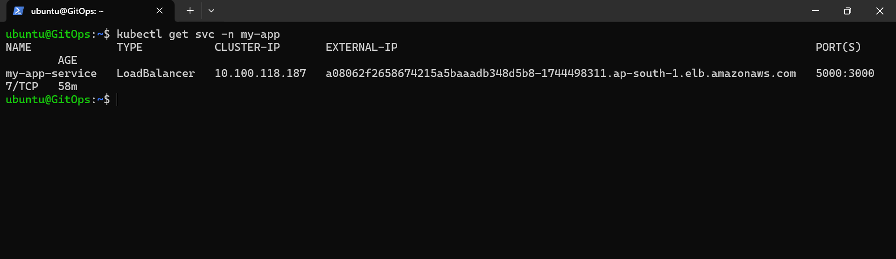

### 5. ArgoCD Installation:

* Namespace created:

```bash
kubectl create namespace argocd
```

* ArgoCD installed:

```bash
kubectl apply -n argocd -f https://raw.githubusercontent.com/argoproj/argo-cd/stable/manifests/install.yaml
```

* ArgoCD UI accessed and logged in.
* New App created pointing to GitHub repo.
* Sync policy set to **Automatic**.

ArgoCD-Pods:
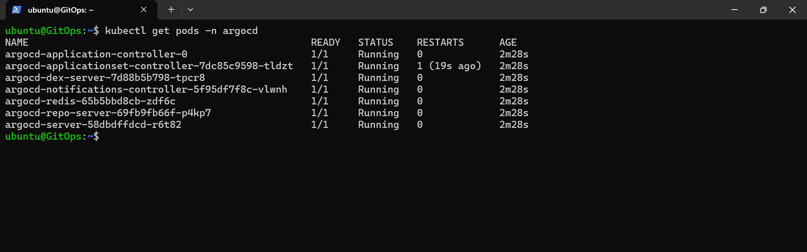

ArgoCD-UI:
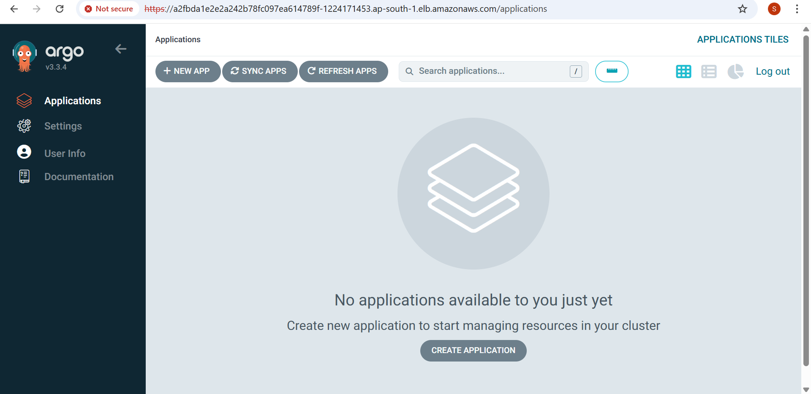

ArgoCD-New-App:
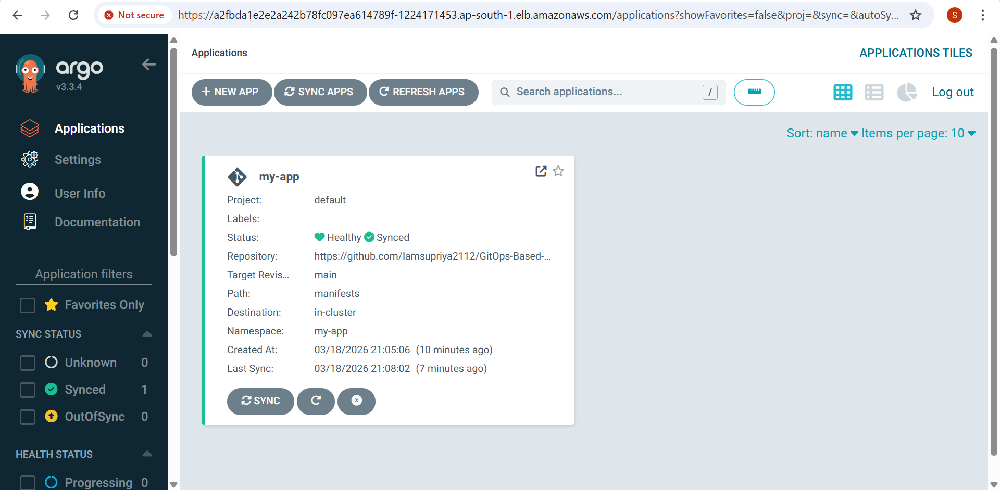

### 6. Git-Based Deployment:

* Modified app code and pushed to GitHub
* ArgoCD automatically detected changes and deployed to cluster.
* Verified app in browser:

```bash
http://<external-ip>:5000
```
Pods Running:


Service Status:


Output:
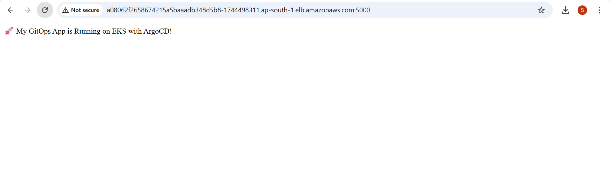

## 7. Modify Docker Image:
- Create new Docker image (**my-app1**)
- Push to registory (**Docker Hub/ECR**)

Docker Image:
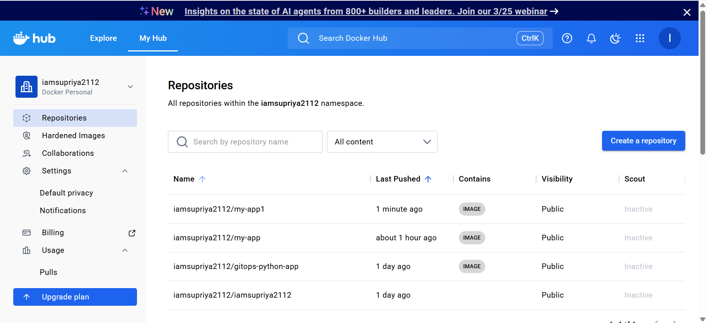


## 8. Update Manifests Files:
- Update Manifests Files (**Deployment.yml**, **Service.yml**)
- Files Push to **Github**
- ArgoCD automatically detected changes and deployed to cluster.
* Verified app in browser:

```bash
http://<external-ip>:5000
```
Pods Running:


Service Status:


Output:
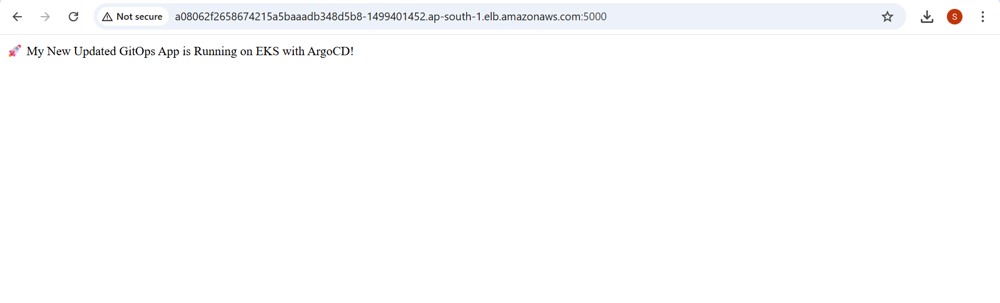

---
## GitOps Flow:

> Flow: GitHub → ArgoCD → EKS → Deployment & NodePort Service → Browser

---
## Conclusion:

* Complete GitOps workflow implemented successfully.
* CI/CD pipeline is automated: Git commit → ArgoCD auto-sync → Deployment → Browser access.
* Project requirements fully met, including containerization, Kubernetes deployment, ArgoCD setup, and automatic Git-based deployment.

---
### Author: Supriya Jadhav
---